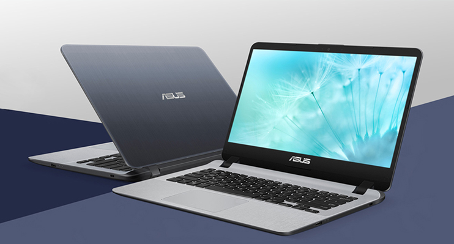
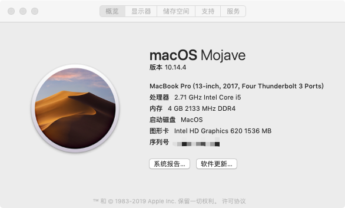
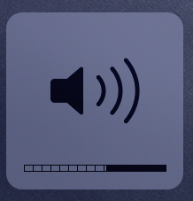
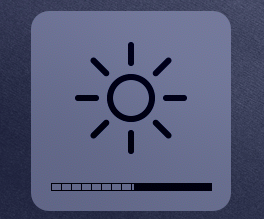
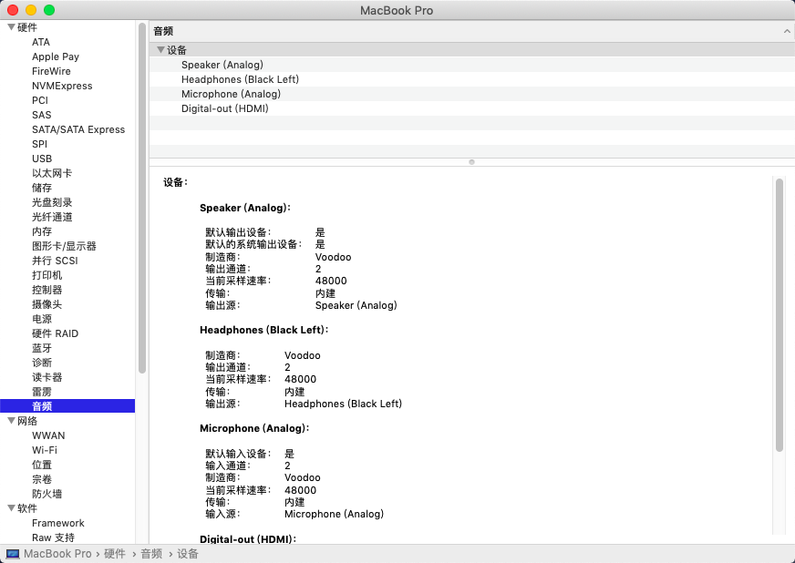
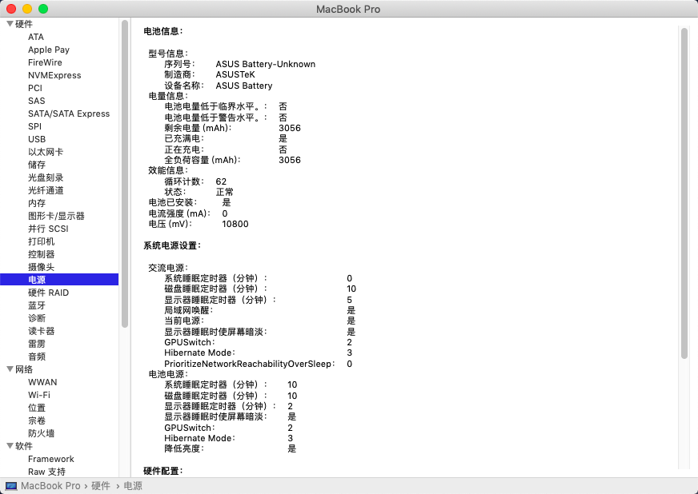
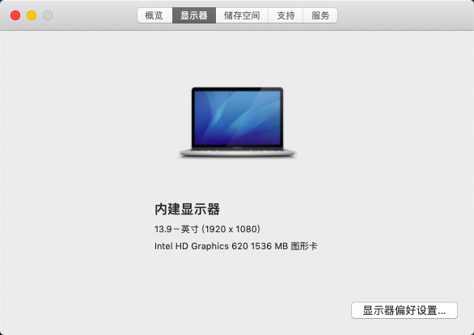
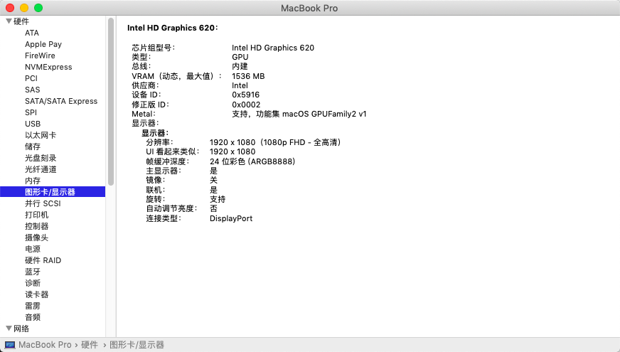
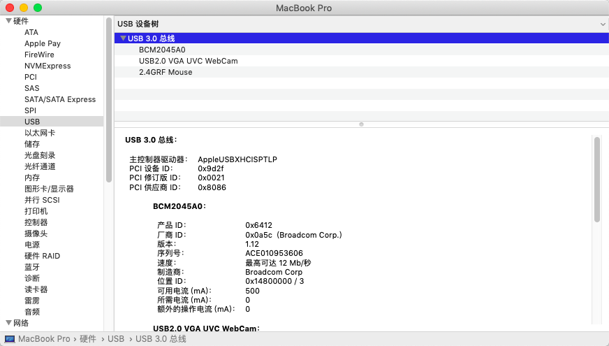

# Hackintosh-EFI-Asus-407UB
A nearly perfect EFI for Asus A407UB(X407UB)
=======
Hackintosh-EFI-Asus-A407UB
=====
Supports from 10.13.6(17G2112) ~ 10.14.5(18F132)

**Attention!!! OpenCore is not supported yet!!!**

## Computer Configuration

| Specifications | Detail                                                             |
| -------------- | ------------------------------------------------------------------ |
| Computer model | ASUS Laptop X407UB(VivoBook 14)                                    |
| Motherboard    | X407UB                                                             |
| Processor      | Intel Core i5-7200U, 3100 MHz                                      |
| Memory         | 4 GB DDR4-2400 DDR4 SDRAM                                          |
| HardDisk1      | SanDisk 128 GB, SATA-III                                           |
| HardDisk2      | TOSHIBA 500 GB, 5400 RPM, SATA-III                                 |
| Graphics Card  | Intel HD Graphics 620                                              |
| Sound Card     | Realtek ALC256 (LayoutID 13)                                       |
| Wireless Card  | DW 1820A(BCM94350ZAE)                                              |
| Bluetooth Card | Bluetooth 4.1 LE                                                   |
| Trackpad       | I2C ETPD FTE1200                                                   |

## Perfectly Working Devices

- [x] HD620 with brightness control
- [x] USB 3.1
- [x] Web Camera
- [x] Battery percentage showing
- [x] Sleeping
- [x] Sensors
- [x] Graphics
- [x] CPU clock speed changing
- [x] Wireless and  Bluetooth

## Worked Devices with Small Issues

- Trackpad (Available after sleep )
- Fn keys  

## Gallery

Still completing...
>>>>>>> first A407UB commit
